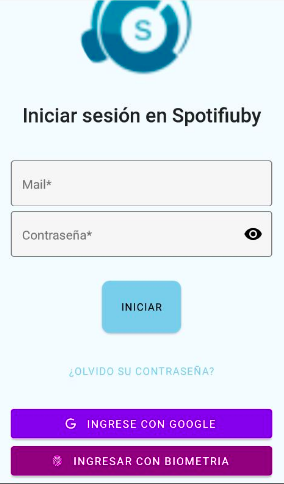
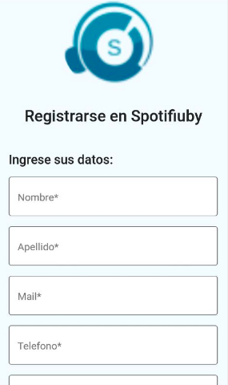
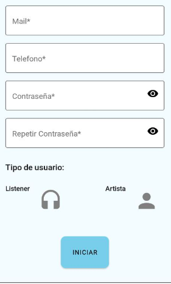
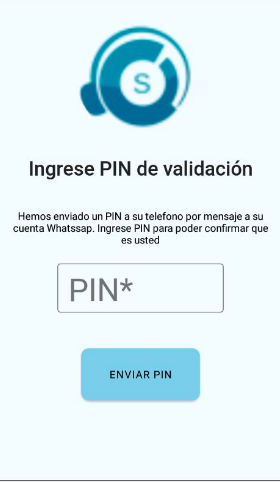
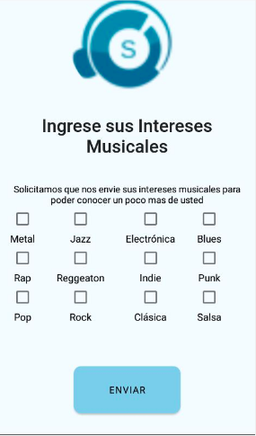

# Spotifiuby

## Guía de usuario de la app

El Usuario entra por primera vez a la aplicación, lo primero que se va a encontrar es con la pantalla de Iniciar Sesión. Una vez aquí el usuario puede iniciar su sesión con mail y contraseña (si ya tiene una cuenta creada), puede navegar a las pantallas para registrarse y para recuperar contraseña, o puede iniciar sesión con Google o con datos biométricos si lo desea:

Si Usuario no tiene una cuenta entonces primero necesita registrarse: oprime 'registrarse' e ingresa todos los datos solicitados por la aplicación:

Luego de ingresar sus datos el usuario recibe un mensaje por Whatsapp donde se indica cual es su PIN de validación de usuario:

Si el Usuario se registró como 'Artista' entonces será redireccionado a la pantalla de iniciar sesión, si entra como 'Oyente' entonces se le solicitará una ubicación y que seleccione sus intereses musicales, una vez finalizado el registro del Usuario se podra entrar en la aplicación:

Si el Usuario ya se registro de manera exitosa entonces puede ingresar a la aplicación con su mail y contraseña:

Si el Usuario ingresa de manera externa por primera vez entonces debera seleccinar si desea entrar como 'Artista' o 'Oyente':

Si en algun momento el Usuario olvida su contraseña entonces puede seleccionar una nueva con la pantalla de '¿Olvido su Contraseña?'

## Guía de usuario del backoffice

## Bitacora del proyecto

### Semana del 20/2/2022
- Se adecuó la arquitectura utilizada en Técnicas de Diseño, con el stack de React, Node, Express y PostgreSQL (con Sequelize como ORM). Al tener un conocimiento básico de este stack, esto puede permitir ahorrar mucho tiempo, y se entiende que tiene más soporte en términos de documentación online para el desarrollo de aplicaciones web que uno con backend en Python debido a su mayor difusión. Por otra parte, usar React Native tiene mútiples similitudes a React, con lo cual es el complemento natural para las tecnologías ya conocidas.
- Se logra una comunicación básica entre los dos repositorios ahora existentes.
- Se plantea una forma básica de lograr el "registro de un usuario", integrando Firebase.

### Semana del 27/2/2022
- Se refina el prototipo de registro de usuario.
- Se logró un despliegue exitoso en Heroku, separando los recursos de desarrollo de los productivos. 
- Se planteó una forma de gestionar los archivos de ambiente, de manera que al hacer un despliegue productivo se utilicen los hosts de Heroku.

### Semana del 6/3/2022
- Se logró un sistema adhoc para impactar los cambios en la base de datos al hacer un despliegue productivo.
- Se integró el resultado de las pruebas con Insmbul y Coveralls.

### Semana del 14/3/2022
- Integración preliminar de Datadog.
- Login preliminar con datos biométricos y cuenta externa para usuarios, y con correo electrónico para admin.
- Inicio preliminar de la parte de pagos.

### Semana del 21/3/2022
- Primer dashboard en datadog.
- Despliegue exitoso de sign in, sign up y forgot password para backoffice.
- Despliegue exitoso de sign in, sign up y forgot password para mobile.
- Integración preliminar con datadog para el seguimiento de requests.

### Semana del 27/3/2022
- Inicio del gateway de apis.
- Primera pantalla de administrador con listado, filtros y alta (de servicios/api-keys). 
- Endpoint de crear wallet listo en servicio de pagos.

### Semana del 3/4/2022
- Integración con servicios desde el backoffice.
- Despliegue dockerizado.
- Endpoints de payments.

### Semana del 10/4/2022
- Integración con Twilio.
- Capa de datos del repositorio con la información del contenido.
- Avance del Gateway en Python.

### Semana del 17/4/2022
- Se confirma que anda el login productivo.
- Carga preliminar de canción en Firebase.

### Semana del 24/4/2022
- Lista de artistas en app, pudiendo seguir artista.
- Búsqueda de artistas para agregar una canción. 
- Editar perfil.

Justificación de los roles del usuario: alineados a la consigna, proponemos permitir a priori que un usuario pueda ser tanto oyente como artista. Esto es debido a que en servicios de contenido multimedia, se entiende que un usuario puede no solamente querer crear contenido, sino también consumir el de otros. De esta forma, un usuario tiene la posibilidad de aprovechar todas las posibilidades de la plataforma (al igual que ocurre con Youtube), o bien, optar por un conjunto limitado (solo oyente, para usuarios comunes, o solo artista, para cuentas profesionales). 

### Semana del 1/5/2022
- Principio del chat.
- Algunos retoques estéticos en la app seǵun feedback.
- Avances menores (retrasados) del nuevo gateway.
- Problemas con el reproductor.

### Semana del 8/5/2022
- Chat con notificaciones.
- Versión preliminar del reproductor, empezando a usar Dev Client en vez de Expo Go, y habiendo tenido que ajustar casi todas las dependencias. Hasta ahora fue uno de los cambios más traumaticos del proyecto.
- Mejoras estéticas del backoffice.

Justificación de porque los oyentes pueden chatear con artistas. La cantidad de seguidores de personalidades famosas (en nuestro caso, artistas) en una red social distribuye exponencialmente: existe un conjunto mayoritario de artistas con pocos seguidores, y un ínfima minoría que concentra cantidades millonarias (o el equivalente, según escala). En ese sentido, a la mayoría de los artistas les sirve tener un canal de acercamiento con su público, y en todo caso la restricción de que a un artista con muchísimos seguidores no se le pueda mandar un mensaje es una de las tantas funcionalidades adicionales que se podrían considerar en el marco de un caso real, pero que están fuera de scope.

### Semana del 15/5/2022
- Reproducir contenido.
- Agregar contenido a favoritos.
- Íconos en el perfil para reemplazar algunos de los botones.
- Certificación de identidad para el artista.
- Mejoras estéticas adicionales en el backoffice. 
- Bloquear contenido en backoffice.

### Semana del 22/5/2022
- Home con "top 3".
- Pruebas para la demo.

### Semana del 29/5/2022
- Algunas correcciones observadas en la demo.
- Primer caso migrado con el nuevo gateway (que solo verifica la clave, y permite al servidor original hacer el request).
- Búsqueda por género. 

### Semana del 5/6/2022

### Semana del 12/6/2022

### Semana del 19/6/2022

### Semana del 26/6/2022

### Semana del 3/7/2022

## Postmortem del Proyecto
