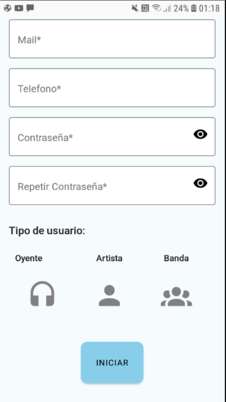
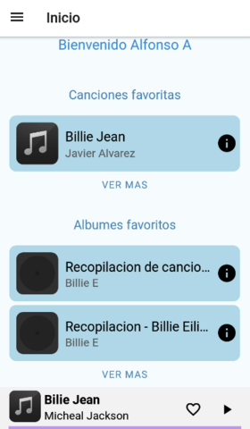
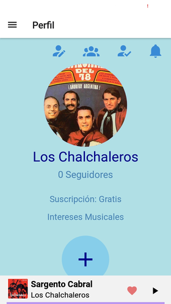
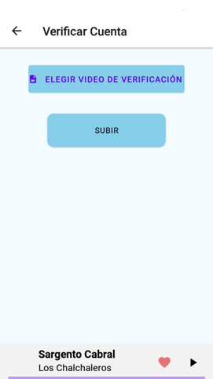
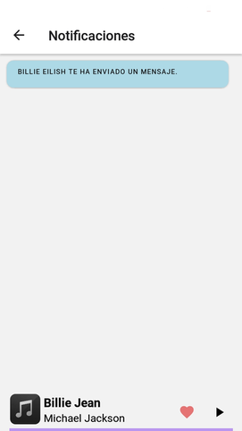
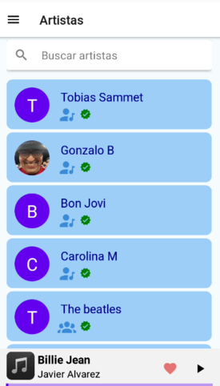

# Guía de usuario de la app Spotifiuby

El Usuario entra por primera vez a la aplicación, lo primero que se va a encontrar es con la pantalla de Iniciar Sesión. Una vez aquí el usuario puede iniciar su sesión con mail y contraseña (si ya tiene una cuenta creada), puede navegar a las pantallas para registrarse y para recuperar contraseña, o puede iniciar sesión con Google o con datos biométricos si lo desea:

Si el Usuario no tiene una cuenta entonces primero necesita registrarse: oprime 'registrarse' e ingresa todos los datos solicitados por la aplicación. Un Usuario puede registrarse como 'Oyente', 'Artista' o como 'Banda':

Luego de ingresar sus datos el Usuario recibe un mensaje por Whatsapp donde se indica cuál es su PIN de validación de Usuario:

Si el Usuario se registró como 'Artista' o como 'Banda' entonces entrará a la aplicación, si entra como 'Oyente' entonces se le solicitará una ubicación y que seleccione sus intereses musicales, una vez finalizado el registro del Usuario se podrá entrar en la aplicación:

Si el Usuario ingresa de manera externa por primera vez entonces deberá seleccionar si desea entrar como 'Artista', 'Oyente' o 'Banda':

Si en algún momento el Usuario olvida su contraseña entonces puede seleccionar una nueva con la pantalla de '¿Olvido su contraseña?'

Una vez dentro de la aplicación el Usuario primero se va a encontrar en la pantalla de Inicio. En esta pantalla se pueden ver una versión resumida de 3 muestras como máximo de lo que es el contenido favorito del Usuario (canciones o álbumes) si el Usuario quiere ver la lista de álbumes o canciones favoritos completa entonces debe oprimir en "ver más" en cada lista:

Arriba a la izquierda se puede ver un menú para poder navegar por la aplicación.

Primero vamos a la pantalla de Perfil. Todos los perfiles tienen una foto de perfil (con una imagen por defecto si el Usuario no elige una) y el nombre del Usuario, además en la parte superior de la derecha van a haber 2 botones: uno para ir a 'Editar Perfil' (Icono de Usuario con lapicera) y otro para ir a 'Lista de Notificaciones' (Icono de campana). Luego cada perfil será diferente según el tipo de Usuario:
- Si es 'Oyente' el perfil incluye una lista de los géneros musicales que el Usuario marca como favoritos, además de una muestra de como máximo 3 elementos de la lista de artistas que el Usuario está siguiendo y de las Playlists que el Usuario creó. También cuenta con un botón para crear una Playlist.
 

 
- Si es un 'Artista' entonces va a tener un botón de subir contenido, así como la cantidad de seguidores que el artista tiene y un cartel que indica si el artista está verificado o no. Además arriba a la derecha se agrega el botón para ir a 'Verificar Cuenta' (Icono de Usuario con un tilde).
 

 
- El perfil de una 'Banda' es exactamente igual al de un 'Artista'. La diferencia es que se agrega arriba a la derecha un botón para ir a 'Agregar Integrantes' (Icono de Grupo), desde ahí se podrá agregar a los integrantes de una banda. Además se podrá ver una lista con los integrantes de la misma. Hay que aclarar que una banda no podrá subir contenido si no tiene integrantes.
 

 
Ahora vamos a analizar los pantallas a las que se puede ir desde un Perfil:
 
- *Editar Perfil*: En esta pantalla un Usuario puede editar su perfil. Todos los tipos de usuario pueden editar su nombre de usuario y su foto de perfil. Los 'Oyentes' pueden editar sus intereses musicales y su tipo de suscripción:
 

- *Verificar Cuenta*: Esta pantalla está únicamente habilitada para los 'Artista' y 'Banda', aquí se puede enviar el video para verificar al artista.

- *Agregar Integrantes*: Esta pantalla está habilitada solo para 'Banda', con ella se puede indicar cuales van a ser los integrantes de la banda:

 
 
- *Subir Contenido* Solo para 'Artista' y 'Banda', como su nombre lo indica en esta pantalla se pueden subir canciones y álbumes. Esta pantalla tiene 2 solapas que indican el tipo de contenido que puede subir cada una. Para subir una canción ir a la solapa de 'Canciones' e ingresar datos solicitados:
 

 
Para subir un álbum ir a la solapa de 'Álbumes' e ingresar datos requeridos:
 

 
- *Crear Playlist*: Solo para 'Oyente'. Aquí un oyente puede crear una playlist:
 

 
- *Lista Notificaciones*: muestra las notificaciones que los usuarios reciben. Oprimir una abre el chat privado con el usuario que le mandó la notificación correspondiente al enviarle un mensaje:
 

 

Si el Usuario vuelve al Menú va a ver que hay una entrada que dice 'Usuarios'. Contiene una lista con todos los usuarios registrados a la aplicación. Esta misma pantalla cuenta con una barra de búsqueda para filtrar a los usuarios por nombre. Cada usuario tiene una etiqueta que le permite reconocer su tipo: los audífonos son para los oyentes, el icono de usuario con nota musical es para los artistas y la banda se reconoce por el icono de grupo.
 

 
Si se selecciona cualquier usuario de la lista entonces su respectivo perfil. Al abrir el perfil de otro usuario se podrá ver que todos los botones explicados antes han desaparecido y ahora aparece arriba a la derecha un botón para abrir el chat privado con el usuario seleccionado. Un caso particular es si el Usuario es un 'Oyente' y abre el perfil de un 'Artista' entonces se podrá ver un botón para 'seguir' o 'dejar de seguir' al mismo:
 

 
Si el Usuario oprime el botón de chat privado entonces se abrirá el chat con el Usuario.
 

 
Cuando se envíe un mensaje entonces al destinatario recibirá una notificación indicando que ha recibido un mensaje y presionarla abrirá para el destinatario el chat directo con el emisor del mensaje:
 

 
La lista de artistas del Menú funciona exactamente como la de usuarios pero solo muestra aquellos usuarios de tipo 'Artista' y 'Banda':
 

 
Luego aparece en el Menu la pantalla de contenido. Esta pantalla contiene la lista de todas las canciones, la lista de todos los álbumes, la lista de todas las Playlists que son públicas y la lista de todo el contenido según su género. Cada una de estas listas no aparece completa, solo hay una muestra de como máximo 3 elementos.
 

 
Para ver completa una de las listas se debe oprimir su respectivo 'ver más':
 

.

 
Si se oprime el botón de información de una canción se abre la pantalla de la misma. Muestra información de la canción como título y autores de la misma. Además se puede agregar/quitar la canción de favoritos:
 

 
Si se oprime el botón de información de algún álbum se abre la pantalla del mismo. Muestra información del álbum junto con la lista de canciones y de autores del mismo. Además se puede agregar/quitar el album de favoritos:
 

 
Si se oprime el botón de información de una playlist se abre la pantalla de la misma. Muestra información de la playlist junto con la lista de canciones y la lista de autores de la misma. Hay un botón para hacer la playlist pública o privada pero solo es visible para los autores de la misma:
 

 
Si se oprime la tarjeta de algun genero de la lista de géneros entonces se abre una lista con todos los álbumes de dicho género:
 

 
Por último se puede ver que en la barra de reproducción aparece la canción que que se está escuchando. Si se oprime esta barra se abre la pantalla de reproducción, aquí se puede ir a la siguiente canción, a la anterior o escuchar la canción en cualquier minuto que se prefiera:
 

## Guía de usuario del backoffice

Al ingrear a la aplicación, se ve la pantalla de ingreso:

El vínculo para recuperar la contraseña permite ingresar el mail de la cuenta para obtener el enlace que permite cambiarla:

Si se ingresa un mail no reconocido, se informará esto con un cartel informativo.

Al seguir el enlace enviado por mail, se podrá ingresar la nueva contraseña.

Una vez que se ingresa a la aplicación, un menú superior permite ver las distintas pantallas.

La de usuarios permite acceder al perfil de los mismos, así como bloquearlos, o marcar a los artistas como verificados.

Al hacer clic en "Ver perfil", se pueden ver las pantallas asociadas a un oyente y a un artista.

Se puede crear un administrador con el botón correspondiente

En todas las pantallas se pueden filtrar las columnas, así como también utililizar la barra de búsqueda:

La pantalla de servicios muestra los componentes de la plataforma, teniendo la posibilidad de bloquearlos o agregar uno nuevo. 

La pantalla de contenido muestra el contenido subido a la plataforma, permitiéndole al administrador bloquearlo. 

La pantalla de transacciones muestra los pagos hechos por los usuarios para acceder al contenido premium.

La pantalla de métricas muestra un tablero de Datadog con estadísticas de interés.

