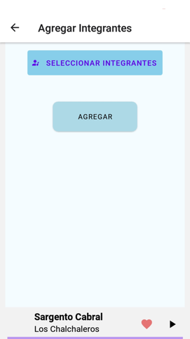
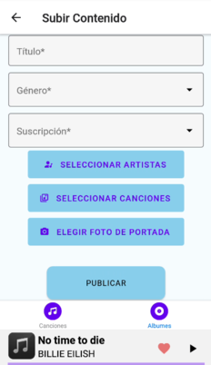
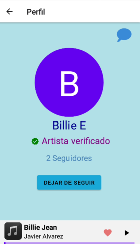
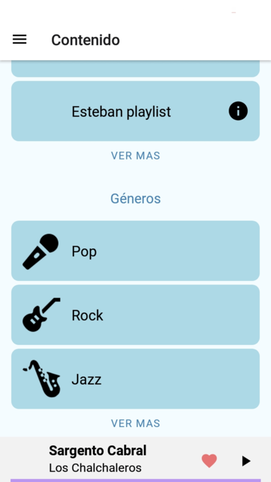

# Bitacora 

# Guía de usuario de la app Spotifiuby

El Usuario entra por primera vez a la aplicación, lo primero que se va a encontrar es con la pantalla de Iniciar Sesión. Una vez aquí el usuario puede iniciar su sesión con mail y contraseña (si ya tiene una cuenta creada), puede navegar a las pantallas para registrarse y para recuperar contraseña, o puede iniciar sesión con Google o con datos biométricos si lo desea:

Si el Usuario no tiene una cuenta entonces primero necesita registrarse: oprime 'registrarse' e ingresa todos los datos solicitados por la aplicación. Un Usuario puede registrarse como 'Oyente', 'Artista' o como 'Banda':

Luego de ingresar sus datos el Usuario recibe un mensaje por Whatsapp donde se indica cuál es su PIN de validación de Usuario:

Si el Usuario se registró como 'Artista' o como 'Banda' entonces entrará a la aplicación, si entra como 'Oyente' entonces se le solicitará una ubicación y que seleccione sus intereses musicales, una vez finalizado el registro del Usuario se podrá entrar en la aplicación:

Si el Usuario ingresa de manera externa por primera vez entonces deberá seleccionar si desea entrar como 'Artista', 'Oyente' o 'Banda':

Si en algún momento el Usuario olvida su contraseña entonces puede seleccionar una nueva con la pantalla de '¿Olvido su contraseña?'

Una vez dentro de la aplicación el Usuario primero se va a encontrar en la pantalla de Inicio. En esta pantalla se pueden ver una versión resumida de 3 muestras como máximo de lo que es el contenido favorito del Usuario (canciones o álbumes) si el Usuario quiere ver la lista de álbumes o canciones favoritos completa entonces debe oprimir en "ver más" en cada lista:

Arriba a la izquierda se puede ver un menú para poder navegar por la aplicación.

Primero vamos a la pantalla de Perfil. Todos los perfiles tienen una foto de perfil (con una imagen por defecto si el Usuario no elige una) y el nombre del Usuario, además en la parte superior de la derecha van a haber 2 botones: uno para ir a 'Editar Perfil' (Icono de Usuario con lapicera) y otro para ir a 'Lista de Notificaciones' (Icono de campana). Luego cada perfil será diferente según el tipo de Usuario:
- Si es 'Oyente' el perfil incluye una lista de los géneros musicales que el Usuario marca como favoritos, además de una muestra de como máximo 3 elementos de la lista de artistas que el Usuario está siguiendo y de las Playlists que el Usuario creó. También cuenta con un botón para crear una Playlist.
 

 
- Si es un 'Artista' entonces va a tener un botón de subir contenido, así como la cantidad de seguidores que el artista tiene y un cartel que indica si el artista está verificado o no. Además arriba a la derecha se agrega el botón para ir a 'Verificar Cuenta' (Icono de Usuario con un tilde).
 

 
- El perfil de una 'Banda' es exactamente igual al de un 'Artista'. La diferencia es que se agrega arriba a la derecha un botón para ir a 'Agregar Integrantes' (Icono de Grupo), desde ahí se podrá agregar a los integrantes de una banda. Además se podrá ver una lista con los integrantes de la misma. Hay que aclarar que una banda no podrá subir contenido si no tiene integrantes.
 

 
Ahora vamos a analizar los pantallas a las que se puede ir desde un Perfil:
 
- *Editar Perfil*: En esta pantalla un Usuario puede editar su perfil. Todos los tipos de usuario pueden editar su nombre de usuario y su foto de perfil. Los 'Oyentes' pueden editar sus intereses musicales y su tipo de suscripción:
 

- *Verificar Cuenta*: Esta pantalla está únicamente habilitada para los 'Artista' y 'Banda', aquí se puede enviar el video para verificar al artista.

- *Agregar Integrantes*: Esta pantalla está habilitada solo para 'Banda', con ella se puede indicar cuales van a ser los integrantes de la banda:

 
 
- *Subir Contenido* Solo para 'Artista' y 'Banda', como su nombre lo indica en esta pantalla se pueden subir canciones y álbumes. Esta pantalla tiene 2 solapas que indican el tipo de contenido que puede subir cada una. Para subir una canción ir a la solapa de 'Canciones' e ingresar datos solicitados:
 

 
Para subir un álbum ir a la solapa de 'Álbumes' e ingresar datos requeridos:
 

 
- *Crear Playlist*: Solo para 'Oyente'. Aquí un oyente puede crear una playlist:
 

 
- *Lista Notificaciones*: muestra las notificaciones que los usuarios reciben. Oprimir una abre el chat privado con el usuario que le mandó la notificación correspondiente al enviarle un mensaje:
 

 

Si el Usuario vuelve al Menú va a ver que hay una entrada que dice 'Usuarios'. Contiene una lista con todos los usuarios registrados a la aplicación. Esta misma pantalla cuenta con una barra de búsqueda para filtrar a los usuarios por nombre. Cada usuario tiene una etiqueta que le permite reconocer su tipo: los audífonos son para los oyentes, el icono de usuario con nota musical es para los artistas y la banda se reconoce por el icono de grupo.
 

 
Si se selecciona cualquier usuario de la lista entonces su respectivo perfil. Al abrir el perfil de otro usuario se podrá ver que todos los botones explicados antes han desaparecido y ahora aparece arriba a la derecha un botón para abrir el chat privado con el usuario seleccionado. Un caso particular es si el Usuario es un 'Oyente' y abre el perfil de un 'Artista' entonces se podrá ver un botón para 'seguir' o 'dejar de seguir' al mismo:
 

 
Si el Usuario oprime el botón de chat privado entonces se abrirá el chat con el Usuario.
 

 
Cuando se envíe un mensaje entonces al destinatario recibirá una notificación indicando que ha recibido un mensaje y presionarla abrirá para el destinatario el chat directo con el emisor del mensaje:
 

 
La lista de artistas del Menú funciona exactamente como la de usuarios pero solo muestra aquellos usuarios de tipo 'Artista' y 'Banda':
 

 
Luego aparece en el Menu la pantalla de contenido. Esta pantalla contiene la lista de todas las canciones, la lista de todos los álbumes, la lista de todas las Playlists que son públicas y la lista de todo el contenido según su género. Cada una de estas listas no aparece completa, solo hay una muestra de como máximo 3 elementos.
 

 
Para ver completa una de las listas se debe oprimir su respectivo 'ver más':
 

.

 
Si se oprime el botón de información de una canción se abre la pantalla de la misma. Muestra información de la canción como título y autores de la misma. Además se puede agregar/quitar la canción de favoritos:
 

 
Si se oprime el botón de información de algún álbum se abre la pantalla del mismo. Muestra información del álbum junto con la lista de canciones y de autores del mismo. Además se puede agregar/quitar el album de favoritos:
 

 
Si se oprime el botón de información de una playlist se abre la pantalla de la misma. Muestra información de la playlist junto con la lista de canciones y la lista de autores de la misma. Hay un botón para hacer la playlist pública o privada pero solo es visible para los autores de la misma:
 

 
Si se oprime la tarjeta de algun genero de la lista de géneros entonces se abre una lista con todos los álbumes de dicho género:
 

 
Por último se puede ver que en la barra de reproducción aparece la canción que que se está escuchando. Si se oprime esta barra se abre la pantalla de reproducción, aquí se puede ir a la siguiente canción, a la anterior o escuchar la canción en cualquier minuto que se prefiera:
 

## Guía de usuario del backoffice

Al ingrear a la aplicación, se ve la pantalla de ingreso:

El vínculo para recuperar la contraseña permite ingresar el mail de la cuenta para obtener el enlace que permite cambiarla:

Si se ingresa un mail no reconocido, se informará esto con un cartel informativo.

Al seguir el enlace enviado por mail, se podrá ingresar la nueva contraseña.

Una vez que se ingresa a la aplicación, un menú superior permite ver las distintas pantallas.

La de usuarios permite acceder al perfil de los mismos, así como bloquearlos, o marcar a los artistas como verificados.

Al hacer clic en "Ver perfil", se pueden ver las pantallas asociadas a un oyente y a un artista.

Se puede crear un administrador con el botón correspondiente

En todas las pantallas se pueden filtrar las columnas, así como también utililizar la barra de búsqueda:

La pantalla de servicios muestra los componentes de la plataforma, teniendo la posibilidad de bloquearlos o agregar uno nuevo. 

La pantalla de contenido muestra el contenido subido a la plataforma, permitiéndole al administrador bloquearlo. 

La pantalla de transacciones muestra los pagos hechos por los usuarios para acceder al contenido premium.

La pantalla de métricas muestra un tablero de Datadog con estadísticas de interés.

# Bitacora del proyecto

### Semana del 20/2/2022
- Se adecuó la arquitectura utilizada en Técnicas de Diseño, con el stack de React, Node, Express y PostgreSQL (con Sequelize como ORM). Al tener un conocimiento básico de este stack, esto puede permitir ahorrar mucho tiempo, y se entiende que tiene más soporte en términos de documentación online para el desarrollo de aplicaciones web que uno con backend en Python debido a su mayor difusión. Por otra parte, usar React Native tiene mútiples similitudes a React, con lo cual es el complemento natural para las tecnologías ya conocidas.
- Se logra una comunicación básica entre los dos repositorios ahora existentes.
- Se plantea una forma básica de lograr el "registro de un usuario", integrando Firebase.

Descripción de la arquitectura utilizada
La arquitectura de los módulos de backend se basa escencialmente en 3 capas. La primera, asociada a la carpeta "data", contiene la definición para la conexión con base de datos utilizando el ORM Sequelize, y las respectivas entidades modeladas. La capa de servicios (de la carpeta "services"), constituye el conjunto de métodos que brindas las funcionalidades que dan sentido a los endpoints, llamando a las respectivas APIs según corresponda (incluyendo el CRUD dado por Sequelize para las entidades, el envío de mail, de whatsapp, las funciones de admin de firebase, etc.). Y por último, existe una capa de rutas, definido en algunos casos en una clase asociada al servicio y en otras contenido en un solo archivo, que funciona como "controller", definiendo el tipo de endpoint, su ruta, y el método al que se llama de la capa de servicios para dar funcionalidad. Como se ve, existen similitudes con lo que plantean otros frameworks como .NET y Spring Boot, solo que por utilizar Express y al ser Javascript un lenguaje de tipado débil, esa estructura es menos marcada y rígida (partiendo de la base de que no hay ni serialización ni deserialización a ningún tipo de dato), pero la idea de separación de incumbencias es escencialmente la misma. No hay inyección de dependencias de por sí, más allá de la parametrización de los componentes "request" y "response" en cada llamada a un controlador (los cuales están definidos por Express): los servicios funcionan de forma independiente, solamente compartiendo el acceso a alguna entidad del modelo, o utilidad genérica común a todo el proyecto.

### Semana del 27/2/2022
- Se refina el prototipo de registro de usuario.
- Se logró un despliegue exitoso en Heroku, separando los recursos de desarrollo de los productivos. 
- Se planteó una forma de gestionar los archivos de ambiente, de manera que al hacer un despliegue productivo se utilicen los hosts de Heroku.

### Semana del 6/3/2022
- Se logró un sistema adhoc para impactar los cambios en la base de datos al hacer un despliegue productivo.
- Se integró el resultado de las pruebas con Insmbul y Coveralls.

### Semana del 14/3/2022
- Integración preliminar de Datadog.
- Login preliminar con datos biométricos y cuenta externa para usuarios, y con correo electrónico para admin.
- Inicio preliminar de la parte de pagos.

### Semana del 21/3/2022
- Primer dashboard en datadog.
- Despliegue exitoso de sign in, sign up y forgot password para backoffice.
- Despliegue exitoso de sign in, sign up y forgot password para mobile.
- Integración preliminar con datadog para el seguimiento de requests.

### Semana del 27/3/2022
- Inicio del gateway de apis.
- Primera pantalla de administrador con listado, filtros y alta (de servicios/api-keys). 
- Endpoint de crear wallet listo en servicio de pagos.

### Semana del 3/4/2022
- Integración con servicios desde el backoffice.
- Despliegue dockerizado.
- Endpoints de payments.

### Semana del 10/4/2022
- Integración con Twilio.
- Capa de datos del repositorio con la información del contenido.
- Avance del Gateway en Python.

### Semana del 17/4/2022
- Se confirma que anda el login productivo.
- Carga preliminar de canción en Firebase.

### Semana del 24/4/2022
- Lista de artistas en app, pudiendo seguir artista.
- Búsqueda de artistas para agregar una canción. 
- Editar perfil.

Justificación de los roles del usuario: alineados a la consigna, proponemos permitir a priori que un usuario pueda ser tanto oyente como artista. Esto es debido a que en servicios de contenido multimedia, se entiende que un usuario puede no solamente querer crear contenido, sino también consumir el de otros. De esta forma, un usuario tiene la posibilidad de aprovechar todas las posibilidades de la plataforma (al igual que ocurre con Youtube), o bien, optar por un conjunto limitado (solo oyente, para usuarios comunes, o solo artista, para cuentas profesionales). 

### Semana del 1/5/2022
- Principio del chat.
- Algunos retoques estéticos en la app seǵun feedback.
- Avances menores (retrasados) del nuevo gateway.
- Problemas con el reproductor.

### Semana del 8/5/2022
- Chat con notificaciones.
- Versión preliminar del reproductor, empezando a usar Dev Client en vez de Expo Go, y habiendo tenido que ajustar casi todas las dependencias. Hasta ahora fue uno de los cambios más traumaticos del proyecto.
- Mejoras estéticas del backoffice.

Justificación de porque los oyentes pueden chatear con artistas. La cantidad de seguidores de personalidades famosas (en nuestro caso, artistas) en una red social distribuye exponencialmente: existe un conjunto mayoritario de artistas con pocos seguidores, y un ínfima minoría que concentra cantidades millonarias (o el equivalente, según escala). En ese sentido, a la mayoría de los artistas les sirve tener un canal de acercamiento con su público, y en todo caso la restricción de que a un artista con muchísimos seguidores no se le pueda mandar un mensaje es una de las tantas funcionalidades adicionales que se podrían considerar en el marco de un caso real, pero que están fuera de scope.

### Semana del 15/5/2022
- Reproducir contenido.
- Agregar contenido a favoritos.
- Íconos en el perfil para reemplazar algunos de los botones.
- Certificación de identidad para el artista.
- Mejoras estéticas adicionales en el backoffice. 
- Bloquear contenido en backoffice.

### Semana del 22/5/2022
- Home con "top 3".
- Pruebas para la demo.

### Semana del 29/5/2022
- Algunas correcciones observadas en la demo.
- Primer caso migrado con el nuevo gateway (que solo verifica la clave, y permite al servidor original hacer el request).
- Búsqueda por género. 
- Certificado de artista reconocido. 

### Semana del 5/6/2022
- Nuevo gateway funcionando.
- Crear playlist.
- Spinners sobre contenido que se está cargando

### Semana del 12/6/2022
- Ajustes para la demo
- Compartir playlist.

Al agregar contenido premium en una playlist pública, cuando un usuario que no pagó la suscripción la quiera abrir, solo va a ver el contenido al que pueda acceder de manera gratuita.

### Semana del 19/6/2022
- Contrato dado por la cátedra desplegado en Kovan.

### Semana del 26/6/2022
- Aumento de cobertura en todos los repositorios. 
- Avances sobre el pago de la suscripción.

### Semana del 3/7/2022
- Aumento de la cobertura.
- Pago de la suscripción exitoso.
- Corrección de detalles en app.
- Preparación para la demo.

## Postmortem del Proyecto
La materia resultó considerablemente compleja, no solamente por la abundancia de tecnologías que hay que aprender e integrar, en paralelo a sacar historias de usuario a contrareloj, sino porque ponerse de acuerdo entre 5 personas (siendo que no necesariamente durante todo el TP hay 5 flujos paralelizables) es particularmente desafiante. Como vemos en materias de gestión posteriores a las obligatorias de la rama de ingeniería de software, cada persona que se agrega a un equpo implica una carga de trabajo adicional asociada a su comunicación con el resto. Solamente si se puede solventar de maner fluída esto es que se logra que tener más personas aumenten el rendimiento en un proyecto que así lo requiera (cuando no, lo disminuye). Otra fuente de esfuerzo fueron los cambios imprevistos sobre los pendientes que se entendían como realizados, los cuales si bien son naturales en cualquier proyecto de software, pueden resultar incluso más engorrosos que el pendiente original, porque se está acarreando la complejidad de mantener una cierta funcionalidad en la medida en que se cambian los componentes que la permiten. 

Una de las cuestiones que se hubieran manejado en forma distinta es el gateway. La mayoría de los integrantes del grupo vieron enunciados anteriores de la materia para empezar a constuir un scaffolding y amortiguar los problemas esencilaes de integración con nuevas tecnologías que eran esperables al principio del proyecto un tiempo antes de tener el enunciado del cuatrimestre. Sin embargo, a partir de los mismos no se entendió que era necesario utilizar de forma obligatoria ambos lenguajes (Javascript y Python) y ambas bases de datos (PostgreSQL y MongoDB). En consecuencia, el gateway tuvo que ser reconstruido luego del primer checkpoint, incorporando 2 tecnologías nuevas con su correspondiente despliegue e integración (y siendo un componente nuclear en la arquitectura). De haber sabido que esas tecnologías eran necesarias, se hubiera empezado a aprender lo básico de las mismas desde antes, como se hizo en Técnicas de Diseño con Node, Express, Docker, React, etc.

En cuanto a la deuda técnica, hay varios comportamientos de aspectos gráficos tanto de la aplicación mobile como de la web que podrían estar encapsulados en componentes de React para ser reutilizables. Del mismo modo, los estilos que se usaron para los mismos podrían estar menos dispersos, no solamente evitando redundancias, sino para organizarlos en archivos específicos (similar a los .css al trabajar con HTML raw). Habiendo aprendido sobre frontend durante el proyecto, podría experimentarse a futuro al utilizar el análogo de la propuesta de Angular pero en React: esto es, pensar las funcionalidades en términos de componentes, cada uno con su archivo de estilos, y su inclusión en una pantalla (teniendo así las capas de "component", "screen" y "style"). Del lado del backend, casi no se utilizaron "clases" de Node, pero su uso podría erradicarse completamente en el futuro, tal como se hizo en los componentes gráficos (donde solo se utilizan Hooks). 

Como una síntesis de lo transitado, se podría rescatar como positivo la comunicación fluída que permitió continuar con avances a pesar de todo tipo de dificultades e imprevistos; como negativo, que no se logró una coordinación ni tasa de progreso acorde a la gran cantidad de tiempo dedidcada a la materia; y como algo a mejorar, intentar ponernos a nosotros mismos plazos para las tareas, que queden plasmados (por ejemplo, en una planilla), de manera de intentar evitar generar bloqueantes. 

Finalmente, el proyecto (cuyo enunciado es el más largo de toda la carrera) resultó enriquecedor, ya que permite poner en práctica habilidades que se requiren y utilizan en la práctica profesional, así como también sirve como una pequeña experiencia de desarrollo no trivial. Sería deseable que otras materias incorporaran mayor énfasis en este tipo de prácticas como forma de internalizar conocimientos. 
